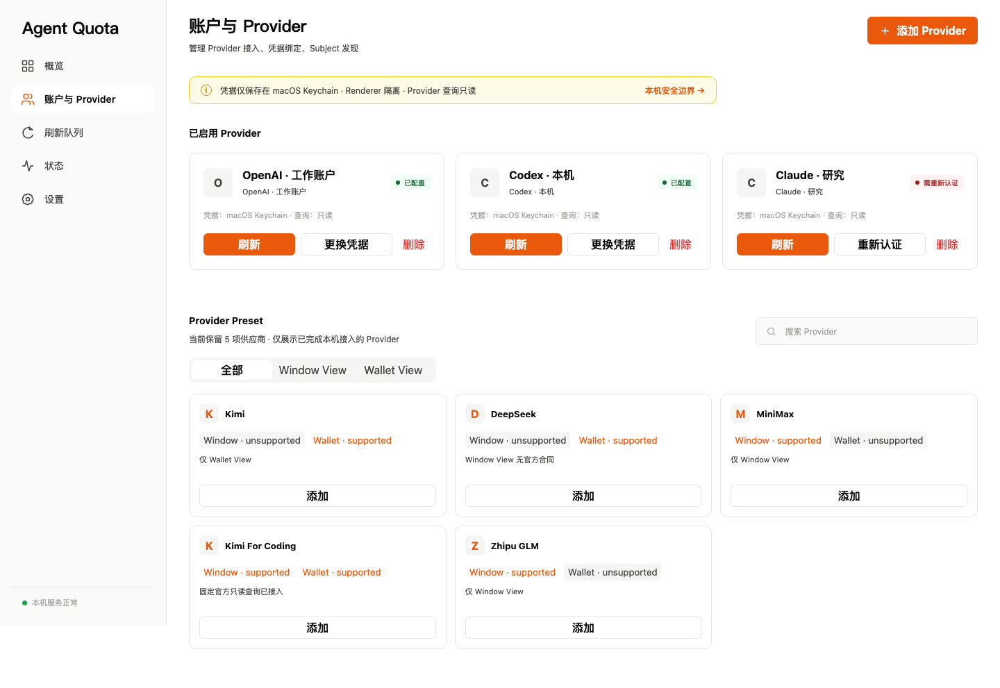
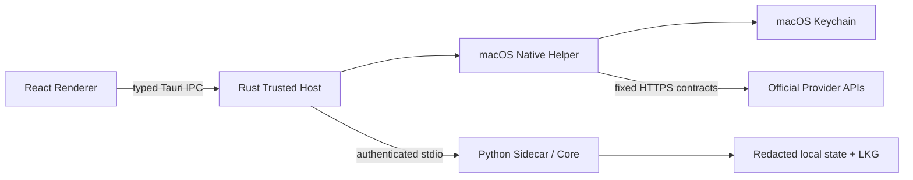

# Agent Quota

<p align="center">
  
</p>

<p align="center">
  <strong>本地优先的 AI Provider 额度控制台</strong><br>
  在一个 macOS 桌面应用中查看订阅窗口、API 余额、刷新状态与健康度。
</p>

<p align="center">
  
  
  <a href="LICENSE"></a>
</p>

<p align="center">
  <a href="#核心能力">核心能力</a> ·
  <a href="#快速开始">快速开始</a> ·
  <a href="#provider-支持">Provider</a> ·
  <a href="#架构">架构</a> ·
  <a href="#开发与验证">开发</a> ·
  <a href="#文档">文档</a>
</p>

---



<p align="center"><sub>界面 Fixture · 合成数据，仅用于展示布局与状态语义</sub></p>

Agent Quota 将不同 Provider 的额度投影到统一桌面视图：窗口额度保持各自周期，钱包余额保持各自币种，跨类型不求和。凭据生命周期由 macOS 原生安全窗口与 Keychain 管理；Renderer 不接触秘密，Provider 查询只访问固定官方接口。

> [!IMPORTANT]
> 当前仓库只允许发布 Source Preview。公开 Release 不附带 `.app`、`.dmg` 或 `.pkg`；正式 macOS 二进制仍需 Developer ID 签名、Apple notarization/stapling 与原生资源身份绑定闭环。

## 核心能力

| 能力 | 行为 |
| --- | --- |
| Window View | 展示 5 小时、周、月等订阅/Coding Plan 窗口 |
| Wallet View | 展示 API 余额、现金、代金券或 Extra Usage，不跨币种合计 |
| 状态语义 | 同时呈现 freshness、health、可用/已用尽/需重认证等状态 |
| 本地凭据 | 原生安全窗口接收秘密，由 macOS Keychain 托管 |
| 失败保护 | 上游响应不符合固定合同即 fail closed，并保留 stale LKG |
| 主动刷新 | 默认按需刷新；无健康 SchedulerHost 时不宣称实时监控 |
| 安全清理 | Purge 只删除已登记状态与精确 Keychain 引用 |

## 快速开始

### 运行界面 Fixture

适合 UI 开发与无真实账户预览：

前置：Node.js `^22.22.2 || ^24.15.0 || >=26.0.0` 与 `pnpm@9.0.0`。

```bash
git clone https://github.com/NOmoreJoke/agent-quota.git
cd agent-quota
pnpm install --frozen-lockfile
VITE_AQ_FIXTURE_MODE=1 pnpm dev
```

打开 `http://127.0.0.1:1420`。该模式使用合成数据，不读取 Keychain，也不证明真实 Provider 可用。

### 构建 macOS 本地开发包

| 前置条件 | 版本/范围 |
| --- | --- |
| macOS | 13.0+，Apple Silicon |
| Python | 3.11 |
| Node.js / pnpm | `^22.22.2 || ^24.15.0 || >=26.0.0` / `pnpm@9.0.0` |
| Rust | `rust-toolchain.toml` 固定的 1.97.1 |
| 其他 | Xcode Command Line Tools、uv |

```bash
uv sync --all-groups --locked
pnpm install --frozen-lockfile
AQ_RUST_BIN=/absolute/persistent/path/rust-1.97.1/bin \
  ./tools/build_macos_package.sh
```

构建输出以 commit 隔离在 `artifacts/iteration-4-<source_commit>/`。产物仅供本机开发验证，不得附加到公开 Release。完整的工具链、签名等级、安装、升级、回滚与 Purge 规则见[安装指南](docs/INSTALLATION.md)。

## Provider 支持

Desktop 只展示存在固定官方查询合同的 5 个 Provider Preset：

| Provider | Window View | Wallet View | 认证方式 | 当前验证证据 |
| --- | --- | --- | --- | --- |
| DeepSeek | — | API 可用余额 | API Key | 官方 schema + 脱敏录制 |
| Kimi | — | API 可用/现金/代金券余额 | API Key | 官方 schema；区域隔离 |
| Kimi For Coding | 周额度、5 小时额度 | Extra Usage | OAuth device code | 官方 OAuth/usage schema |
| MiniMax | general/video 周额度、5 小时额度 | — | Token Plan Key | 官方 schema + fixture |
| Zhipu GLM | 月度额度、5 小时额度 | — | Coding Plan Auth Token | 官方 schema + fixture |

底层 78 行目录用于合同与审计输入，不代表 Desktop 支持或实时查询能力。静态价格页、RPM、控制台 UI 和第三方宣称不会升级 Provider 支持等级。详见 [Provider 能力矩阵](docs/PROVIDER_CATALOG.md)。

## 使用流程

1. 在“账户与 Provider”中选择支持的 Provider。
2. 通过 macOS 原生安全窗口完成凭据配置。
3. 手动刷新，在 Window/Wallet View 中查看额度、freshness 与 health。

遇到 `needs-reauth`、`provider-unavailable` 或 `contract-error` 时，应用保留最后可信快照但标记为 stale，不把失败响应展示为新鲜数据。详见[用户指南](docs/USER_GUIDE.md)。

## 架构



| 层 | 目录 | 职责 |
| --- | --- | --- |
| Renderer | `src/ui/` | 额度投影、Provider 管理、刷新队列与状态页 |
| Trusted host | `src-tauri/` | IPC allowlist、进程边界、超时与原生确认 |
| Native helper | `native/` | Keychain、host-owned 安全窗口与固定 Provider HTTPS 请求 |
| Core / sidecar | `src/agent_quota/` | Provider 响应合同、快照、LKG、本机脱敏状态与 CLI |
| Verification | `tests/`、`tools/` | Python/Rust/Renderer/E2E、包审计与发布门禁 |
| Contracts | `docs/contracts/` | 安全、操作、留存、lease 与 registry 机器合同 |

Agent Quota 不包含 Web 后端，不开放 loopback 业务服务；Hermes、飞书、SchedulerHost 为可选集成，不是 Desktop MVP 依赖。

## 安全边界

- Renderer 只调用机器登记的 Tauri command，不接收凭据、确认 nonce 或原始 Provider 错误体。
- Host 通过匿名 stdio 启动 hash-pinned sidecar，不监听 TCP/UDP。
- Provider endpoint、认证方式与必需响应结构固定；非法币种、数值语法或金额组合 fail closed。
- 普通卸载保留本机状态；破坏性删除必须通过应用内原生确认和 journal 精确执行。

漏洞请通过 GitHub Security Advisories 私下报告，不要在公开 Issue 中提交凭据或真实账户响应。详见[安全策略](SECURITY.md)与[安全模型](docs/security-model.md)。

## 开发与验证

本地开发覆盖 Python core、React renderer、Rust trusted host 与 Playwright E2E。完整命令、覆盖率要求和合同文档 clean-install gate 见[贡献指南](CONTRIBUTING.md)；修改前先确认其中记录的仓库基线。

## 文档

| 文档 | 内容 |
| --- | --- |
| [安装指南](docs/INSTALLATION.md) | 构建、安装、升级、回滚、卸载与 Purge |
| [用户指南](docs/USER_GUIDE.md) | 账户配置、刷新与错误处理 |
| [Provider Catalog](docs/PROVIDER_CATALOG.md) | 支持等级、能力矩阵与验证边界 |
| [产品需求](docs/PRD.md) | MVP 范围与产品规则 |
| [设计方案](docs/design-proposal.md) | 完整领域与运行时设计 |
| [Provider 合同](docs/provider-contract.md) | 身份、请求、响应与错误契约 |
| [安全模型](docs/security-model.md) | 信任边界、威胁与门禁 |
| [性能目标](docs/PERFORMANCE.md) | 性能预算与测量方法 |
| [审计历史](docs/contracts/history-manifest-v1.json) | 第 1–20 轮审计索引 |
| [Source Preview 说明](docs/releases/v0.1.0-preview.1.md) | 下载范围、禁止项与已知阻断 |

<!-- AQ-NORMATIVE-DECISION-LINK-V1:docs/audits/gui-product-decision-resolution.md -->
Desktop GUI 与 Codex/OpenRouter 的规范决策见 [`gui-product-decision-resolution.md`](docs/audits/gui-product-decision-resolution.md)。

<details>
<summary>机器审计状态</summary>

<!-- AQ-GENERATED-CURRENT-STATUS-V1:BEGIN -->
```json
{"design_version":"v2.5","gate_status":"ZERO_ISSUES_AUDIT_CONFIRMED","latest_audit_path":"docs/audits/round-20-audit.md","latest_audit_verdict":"PASS_ZERO_ISSUES","latest_issue_ids":[],"revision_round":20,"status_kind":"ZERO_ISSUES"}
```
<!-- AQ-GENERATED-CURRENT-STATUS-V1:END -->

该 marker 必须与 history manifest 保持一致。`ZERO_ISSUES_AUDIT_CONFIRMED` 仅表示可进入后续 Gate 0A，不等于实现完成、真实 Provider 验收或生产发布授权。

</details>

## License

[MIT](LICENSE) © Agent Quota contributors
