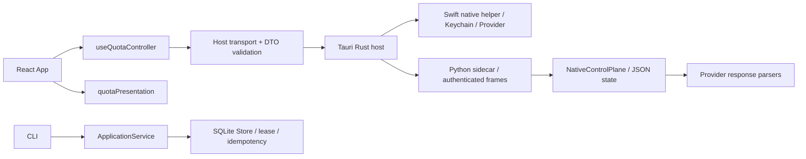

# 仓库审查与重构记录 · 2026-09-08

## 基线与范围

| 项目 | 核验值 | 边界 |
|---|---|---|
| 原工作区 | `dev@07a9a47` | 保留原有 4 项未提交改动 |
| 重构基线 | `source-preview@05d6376` | 已用 `git ls-remote` 核对远端 |
| 重构分支 | `codex/repo-refactor-20260908` | 独立 worktree；尚未合并、推送 |
| 审查范围 | Python / React / Rust / Swift / CI / 打包 / 合同 | 源码、离线测试、结构审查 |
| 未执行 | 真实 Provider、真实凭据、安装发布生命周期 | 不以 fixture 测试代替验收 |

## 架构与责任

| 层 | 当前实现 | 优化判断 |
|---|---|---|
| React | 五个导航页；Host DTO 展示；无直接 Provider 请求 | 已分离展示计算与 Host 动作；保留原布局 |
| Tauri | 命令校验、互斥、进程监督、资源校验 | 保留边界；修复 native 子进程退出等待 |
| Swift | 原生确认、Keychain、认证、固定 Provider 请求 | 1598 行单文件；CI 增加真实编译和离线最小化自检 |
| Python 桌面 | native 元数据、投影、凭据引用生命周期 | 与 CLI SQLite 不共享存储；不直接强行合并 |
| Python CLI | scope 授权、幂等、lease/fencing、快照 | 修复准备阶段清理和请求 deadline |
| Provider | manifest + 响应解析；另有 Swift 请求配置、UI 可见列表 | 多处映射存在维护成本；后续以产品合同驱动统一 |
| 合同 | 冻结 JSON、digest、固定运行时及反例门禁 | 本轮保持字节不变；门禁环境阻塞单列 |
| 打包 | clean-source lock、资源清单、SBOM、审计及原子发布 | 本轮不生成 DMG；源码修复不构成发行验收 |

## 已修复问题

| 优先级 | 触发条件 → 原行为 | 修复 / 证据 |
|---|---|---|
| P1 | helper 输出完整后不退出 → `child.wait()` 无界等待、占用 gate | 读取与退出共用 deadline；`try_wait`；超限先终止；两项 Rust 反例 |
| P2 | 私有状态被替换为无写端 FIFO → `open` 在类型校验前阻塞 | `O_NONBLOCK`；独立子进程 + 超时保护回归 |
| P2 | 同幂等 key 在检查与插入之间被另一调用完成 → IntegrityError、lease 未释放 | 准备阶段纳入 finally；冲突复读并验证 scope；后续请求可继续 |
| P2 | adapter 超过请求预算但 lease 尚有效 → 迟到快照仍发布 | fetch 返回后核验 deadline；记录 outcome_unknown；禁止幂等重放请求 |
| P2 | 刷新/凭据/删除完成后状态读取失败 → 成功消息覆盖读取错误 | load 显式返回结果；保留旧数据、标为 stale；成功提示取决于重新读取 |
| P2 | 认证、删除、清理、导出 invoke reject → 未处理 Promise | 统一动作错误出口；busy/ref 阻止同时提交 |
| P1 | native 返回 cancelled + safe_error → 错称用户取消、未更改数据 | safe_error 优先；显示结果未知/未完整完成；已提交凭据仍读取新账户 |
| P2 | CI 只造 native 资源占位 → Swift 代码缺编译覆盖 | 加入 `build_native_helper.sh`，含响应最小化自检 |

代码入口：

- `src/ui/App.tsx`：视图状态、组件与布局，530 → 301 行。
- `src/ui/quotaPresentation.ts`：额度解释、分组、排序；不调用 Host。
- `src/ui/useQuotaController.ts`：读取、动作互斥、错误与结果状态。
- `src/agent_quota/service.py`：lease 生命周期与 adapter 执行分离。
- `src/agent_quota/filesystem.py`、`src-tauri/src/native.rs`：边界故障处理。

## 后续重构队列

| 优先级 | 范围 | 验收标准 |
|---|---|---|
| P0 发布 | `KNOWN_ISSUES.md` RC-001–006 | 产品能力、真实账户生命周期、Developer ID/公证逐项闭环 |
| P1 架构 | 产品模型与 Provider 配置统一 | 以 `docs/acceptance-matrix-v2.json` 为输入；UI/Swift/Python 能力差异有机器校验；保持 disabled 产品禁用 |
| P1 验证 | 固定合同运行环境恢复 | 原 runtime bootstrap 全部通过；不改版本串或软链接绕过身份校验 |
| P2 模块 | Rust `lib.rs` / Swift helper / Python native control 拆分 | 按命令编排、认证、网络、投影拆分；分别做错误注入；安全合同保持不变 |
| P2 数据 | CLI 与桌面双路径定位 | 先明确 CLI 是否承载正式桌面能力，再决定共享领域模型；不直接迁移用户数据 |
| P2 测试 | UI 分支覆盖与初始连接状态 | 覆盖原生取消/成功/失败、首次 Host 失联与卸载中请求；不能只看总覆盖率 |
| P2 性能 | 原生空闲功耗、内存与唤醒 | 按 `docs/PERFORMANCE.md` 测量；本轮无性能数值结论 |
| P2 依赖 | 冻结合同校验器依赖 | 按 RC-009 更新锁及闭合摘要；本轮未做新漏洞库扫描 |

## 验证记录

| 门禁 | 结果 | 说明 |
|---|---|---|
| Python 基线 | PASS | 284 tests；含分支统计的总覆盖率 90.25% |
| Python 修改后 | PASS | 289 tests；含分支统计的总覆盖率 90.31% |
| Ruff / mypy | PASS | 实现与测试静态检查 |
| Renderer | PASS | 37 tests；语句覆盖 85.67%，行覆盖 88.73% |
| lint / typecheck / boundary / build | PASS | 生产 bundle 不含 fixture |
| Playwright | PASS | 4 tests；导航、异常、响应式、Provider 筛选、侧栏布局 |
| Swift | PASS | arm64 编译、warnings-as-errors、provider-minimization 自检 |
| Rust | PASS | fmt / clippy；37 tests（默认 3 个环境条件测试早退）；production arm64 clippy |
| Rust ↔ Python | PASS（复测） | 显式指定 sidecar/Python 运行 6 tests；首次 2 项 2s 超时，诊断启动成功后同原入口复测 6/6；未修改代码或放宽预算，首次超时根因未证实 |
| 冻结合同门禁 | BLOCKED | `runtime_bootstrap_error=operating system release mismatch` |
| 完整 DMG / 安装生命周期 | 未执行 | dirty review worktree 不满足打包 clean-source lock |
| 独立门禁第 1 轮 | PASS | 初审拦下取消/未知误报，复审拦下新增账户不可见；修复并新增反例后通过 |
| 独立门禁第 2 轮 | PASS | service/filesystem 32 tests、hook 31 tests、renderer boundary；独立双 Store 跨 scope 幂等竞争验证 |
| 独立门禁第 3 轮 | PASS | 全部变更及新增代码/测试、报告、日志核对；数字与范围一致；无本轮代码阻断 |

独立审查通过仅指本轮改动，不能替代合同门禁、真实 Provider 或正式发布验收。
