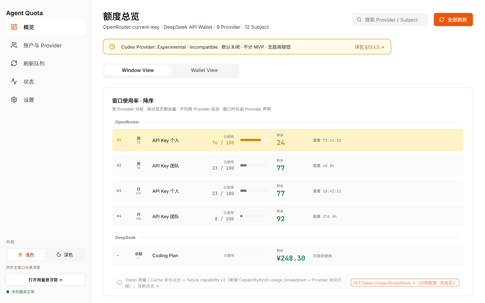
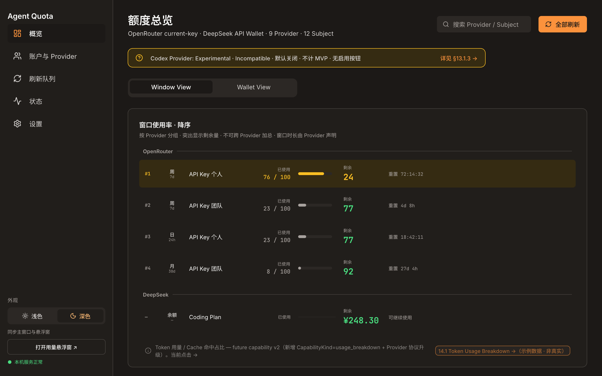
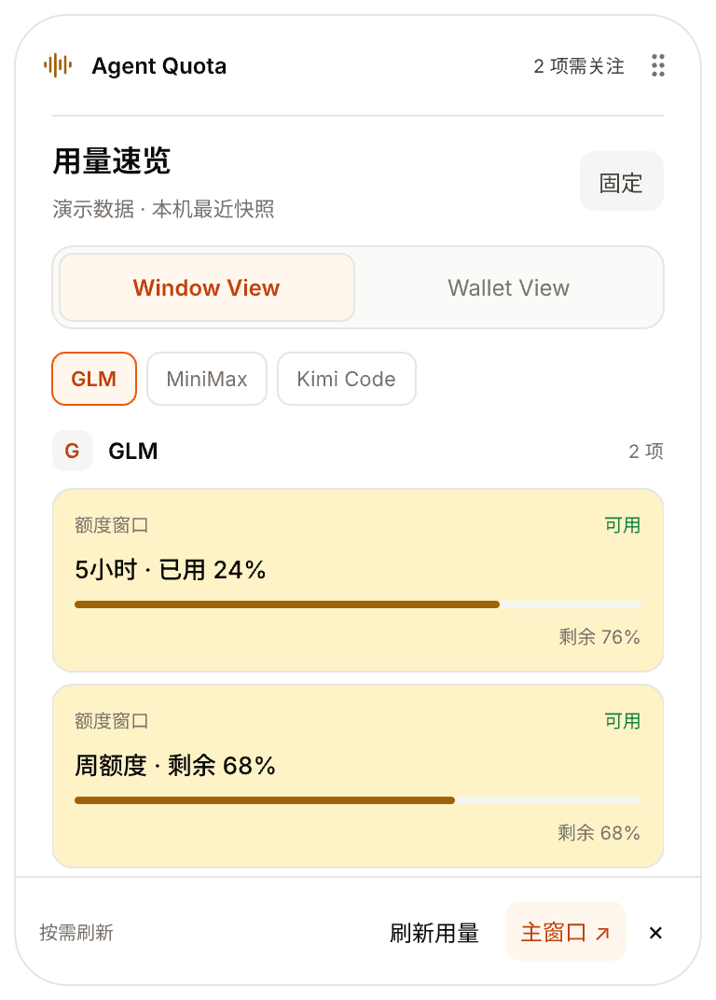
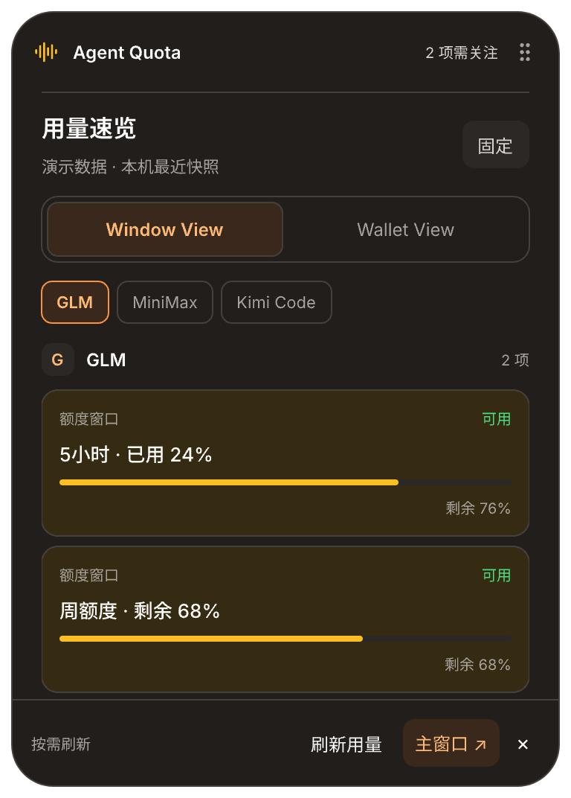
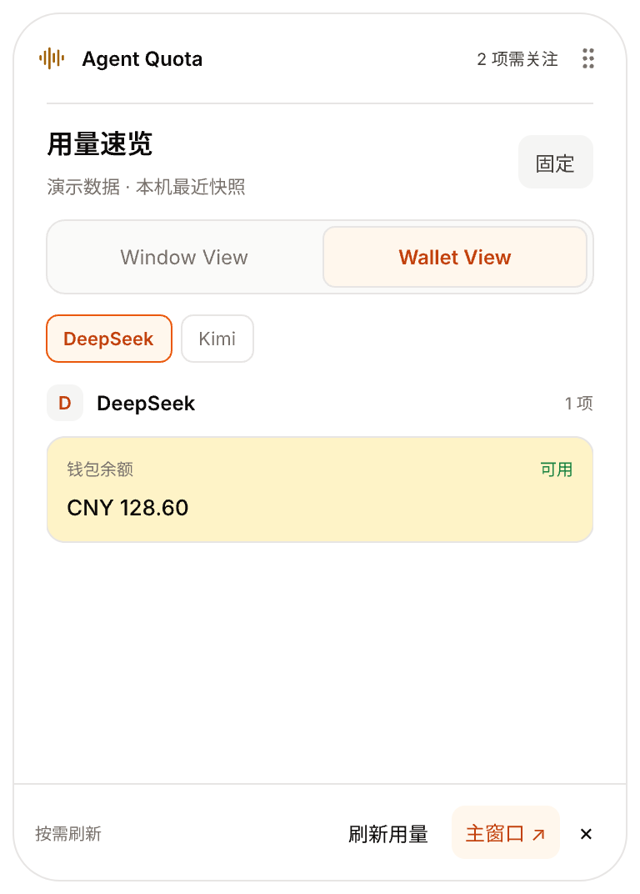
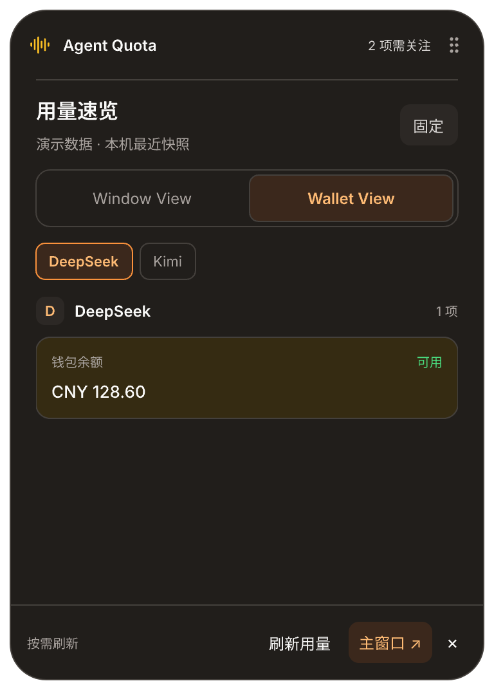

# 浅色与深色原型

源文件为 [agent-quota-desktop.pen](../agent-quota-desktop.pen)。`18.x Appearance` 补齐主窗口外观入口及浅深对照；`17.x Floating` 的九种状态各有浅色和深色画板。所有界面均使用演示数据，文字、按钮、图标、进度条和容器保持可编辑。

主窗口侧栏底部新增「外观 → 浅色 / 深色」，默认浅色。选择同步到浮窗并保存在本机；不触发供应商查询、不改动账户或额度。视觉语义与实现说明见 [APPEARANCE.md](../../APPEARANCE.md)。

| 主窗口浅色 | 主窗口深色 |
| --- | --- |
|  |  |

| 浮窗浅色 | 浮窗深色 |
| --- | --- |
|  |  |
|  |  |

## 画板索引

| 画板 | Pen 节点 | 位置 / 预览 |
| --- | --- | --- |
| 全局外观规范 | `FnbpQ` | `0, 30520` / [规范图](appearance-guide.png) |
| 主窗口浅色 | `LE4oj` | `0, 31080` / [预览](main-light.png) |
| 主窗口深色 | `PLuUm` | `1440, 31080` / [预览](main-dark.png) |
| 可复用切换组件 | `FFGrQ` | `-708, 850` / [预览](appearance-switch.png) |
| 浮窗深色说明 | `GsFpm` | `2200, 27880` |
| 收起胶囊 / 深色 | `P6ZFm` | [预览](collapsed-dark.png) |
| GLM 窗口 / 深色 | `zGs8e` | [预览](window-glm-dark.png) |
| MiniMax 周额度限制 / 深色 | `L5FPP` | [预览](window-minimax-dark.png) |
| DeepSeek 钱包 / 深色 | `s9lPVD` | [预览](wallet-deepseek-dark.png) |
| Kimi 钱包固定 / 深色 | `AtOi4` | [预览](wallet-kimi-pinned-dark.png) |
| 未添加账户 / 深色 | `o4LN4` | [预览](empty-accounts-dark.png) |
| 分类为空 / 深色 | `XOwYl` | [预览](empty-window-dark.png) |
| 离线缓存 / 深色 | `GQAG1` | [预览](offline-cache-dark.png) |
| 刷新结果未知 / 深色 | `Zads7` | [预览](refresh-unknown-dark.png) |

浅色浮窗的节点及预览见 [原状态索引](../floating-usage/README.md)。切换组件已接入公共 Sidebar，因此原有主窗口画板也展示入口。

## 检查范围

- 保存后重开同一 Pen，检查浅深主窗口、浮窗窗口额度、钱包、空状态、耗尽、离线及未知结果截图。
- 对比更新前后顶层节点摘要：未删除任何画板；修改范围限于 Sidebar、示例总览、额度列表组件、原有浮窗模块；新增 14 个顶层组件或画板。公共颜色变量新增 `appearance=light/dark` 主题轴。
- 结构检查无意外溢出；离线状态的额度滚动区按原规格露出部分下一条内容，操作栏完整可见。
- Pen 是视觉状态与规则说明，不包含可执行切换。网页与原生运行证据在实现说明和本地安装验收记录中分别列出。
