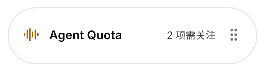

# 悬浮用量窗原型

源文件：[agent-quota-desktop.pen](../agent-quota-desktop.pen)，`17.x Floating` 模块。以下为统一主题后的浅色状态，由 Pen 原生图层导出，仅使用演示数据；可编辑源仍在同一 Pen 文件中。每个状态对应的深色画板及主窗口切换入口见 [浅深主题原型](../appearance/README.md)。

## 状态索引

| 编号 | 状态 | Pen 节点 | 预览 |
| --- | --- | --- | --- |
| 17.0 | 设计与交互说明 | `VkuuY` | 画布 `0, 27880` |
| 17.1 | 收起胶囊 | `wp0l3` | [collapsed.png](collapsed.png) |
| 17.2 | Window View / GLM，5 小时后接周额度 | `dbAVO` | [window-glm.png](window-glm.png) |
| 17.3 | Window View / MiniMax，周额度耗尽约束短周期 | `ZJvq0` | [window-minimax.png](window-minimax.png) |
| 17.4 | Wallet View / DeepSeek | `wnEij` | [wallet-deepseek.png](wallet-deepseek.png) |
| 17.5 | Wallet View / Kimi，已固定 | `moci9` | [wallet-kimi-pinned.png](wallet-kimi-pinned.png) |
| 17.6 | 未添加账户 | `U2kYj7` | [empty-accounts.png](empty-accounts.png) |
| 17.7 | 有账户但当前分类为空 | `KDdFn` | [empty-window.png](empty-window.png) |
| 17.8 | 离线缓存 | `a0ggb` | [offline-cache.png](offline-cache.png) |
| 17.9 | 刷新结果未知 | `j8fjB` | [refresh-unknown.png](refresh-unknown.png) |
| 17.10 | 状态与验收索引 | `tRvAk` | 画布 `440, 29580` |

## 主要视图

| Window View | Wallet View |
| --- | --- |
|  |  |

## 交互与验证边界

- 先选择 Window View / Wallet View，再从横排供应商简称选择；每类分别记住选择，只显示该供应商在当前分类中的数据。选项消失后回退，无数据时展示空状态。
- 外观默认浅色；在主窗口侧栏切换浅色 / 深色，浮窗同步并记住选择，信息层级和操作不变。
- 悬停 160ms 展开，移出 350ms 收起；固定后保持展开，Escape 取消固定并收起。胶囊右侧拖动柄移动窗口。
- 收起为 264×72，展开为 384×536 逻辑像素，均含 8px 透明外边距。离线画板底部露出部分周额度，表示该内容区可纵向滚动；操作栏保持可见。
- 上游只提供账户额度时保持账户级展示，不虚构模型明细。窗口进度表示剩余，钱包显示币种和余额，不跨平台合计。
- 原型是状态画板及交互说明，不包含可执行页面跳转。浏览器交互由代码与 E2E 验证；原生透明置顶、拖动、多屏和应用退出仍待桌面运行验收。
- 详细实现、构建检查和发布边界见 [FLOATING_WIDGET.md](../../FLOATING_WIDGET.md)。
